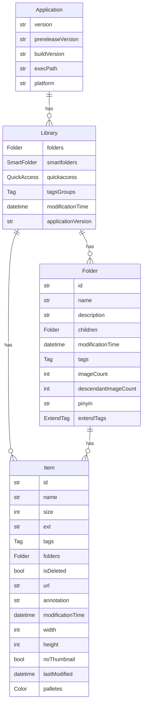

# eagle.py wrapper structure

```mermaid
erDiagram

Application ||--o{ Library : has
Library ||--o{ Item : has
Library ||--o{ Folder : has
Folder ||--o{ Item : has

Application {
str version
str prereleaseVersion
str buildVersion
str execPath
str platform
}

Library {
Folder folders
SmartFolder smartfolders
QuickAccess quickaccess
Tag tagsGroups
datetime modificationTime
str applicationVersion
}

Folder {
str id
str name
str description
Folder children
datetime modificationTime
Tag tags
int imageCount
int descendantImageCount
str pinyin
ExtendTag extendTags
}

Item {
str id
str name
int size
str ext
Tag tags
Folder folders
bool isDeleted
str url
str annotation
datetime modificationTime
int width
int height
bool noThumbnail
datetime lastModified
Color palletes
}
```

